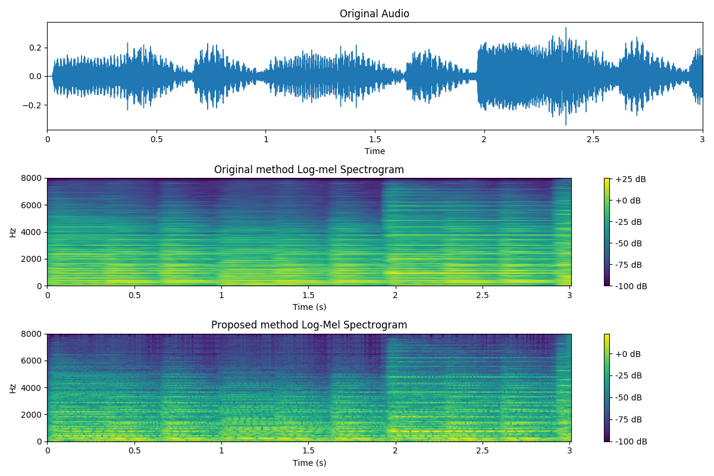
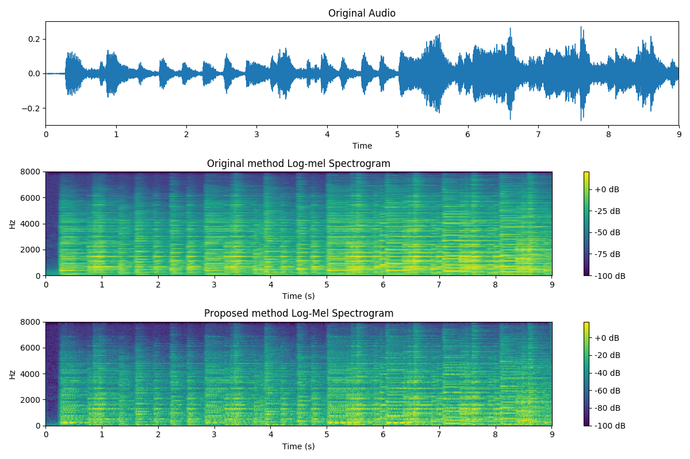

# BSc Thesis: Enhancing Music Transcription with Deep Neural Networks through Trainable Filterbanks

The BSc dissertation can be found [here](pergamos url)

## Abstract: 
In recent years, Automatic Music Transcription, the process of converting audio recordings
into symbolic representations without the human intervention, has witnessed significant
advancements and has been applied across various domains in the music field. Many
existing approaches utilize Deep Neural Networks and rely on learning their input features
directly from representations like log-mel spectrograms. This leads to challenges such as
a high number of trainable parameters, limited adaptability, and slow convergence. In this
thesis, we tackle these challenges by proposing a new method to enhance piano transcription
systems through the incorporation of trainable filterbanks for feature extraction.
Drawing inspiration from SincNet, a Convolutional Neural Network architecture that implements
parameterized sinc-based filterbanks, we aim to improve the accuracy and efficiency
of an existing high-resolution piano transcription system. Our proposed framework
achieves an Average Precision Score of 89% and surpasses the accuracy of the onset
and offset detections of the original method.

This repository is based on the code implementation of [high-resolution piano transcription system](https://github.com/bytedance/piano_transcription).
The [SincConv_fast](https://github.com/mravanelli/SincNet/blob/master/dnn_models.py) class from SincNet architecture is also used for the purpose of this work.

## Environments
As indicated by the original work: Python 3.7 and PyTorch 1.4.0, although it can work with more recent versions of Pytorch.
Installing dependencies:
```
pip install -r requirements.txt
```

## Train the Sinc-based Piano transcription using pretrained model
Download the pretrained model of the original method https://zenodo.org/records/4034264, which is loaded in main.py file
Follow the rules as provided in the baseline method to prepare the data of the MAESTRO dataset.
Execute the train command in runme.sh. This file is a modification of the [original](https://github.com/bytedance/piano_transcription/blob/master/runme.sh) one
According to the original repository, 29 GB GPU memoroy is required with a batch size of 12. All the training experiments in this repository were conducted with a batch size of either 10 or 11 using GPU NVIDIA GeForce RTX
4090.

## Results
The system is trained for 100k iterations in this repository. The training looks like the one of the original.

## Visualization of Sinc-based piano transcription

Run spectro_sinc_batches.py as ```python3 spectro_sinc_batches.py``` to visualize a 10-second recording. The resulting figure consists of a audio waveform, a log-mel spectrogram from the original method and a log-mel spectrogram from our proposed one, without being trained. For testing the trained proposed model, run proposed_testing.py file as ```python3 proposed_testing.py``` and uncomment lines 415-434 in the models.py file.

**Demo 1.**  Dmitri Shostakovich: Waltz No. 2 [[audio]](resources/waltz.mp3).



**Demo 2.**  S.Rachmaninoff: Prelude in G Minor Op. 23 No. 5 [[audio]](resources/rach_cut.mp3).


